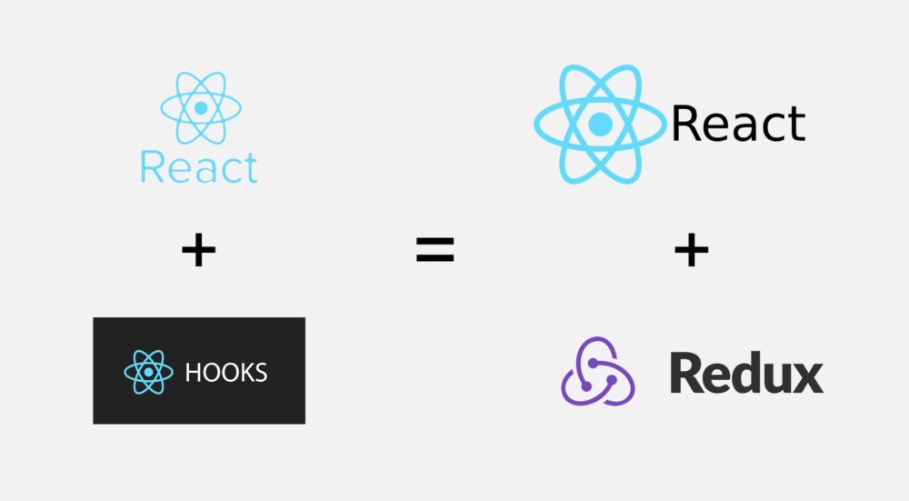
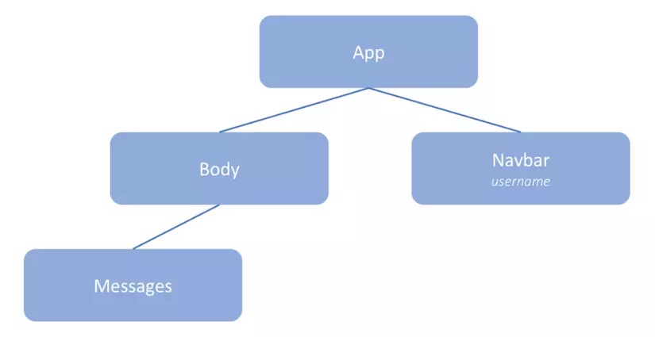
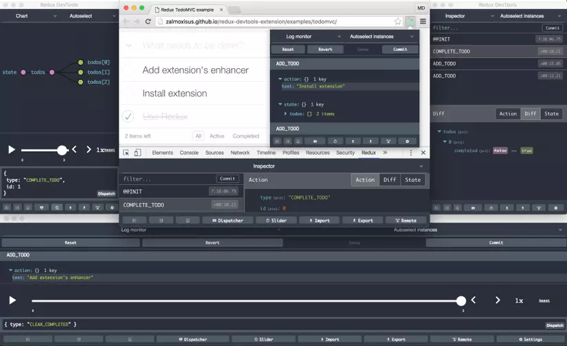
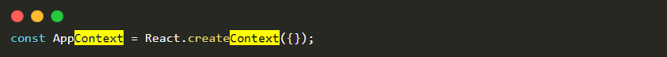
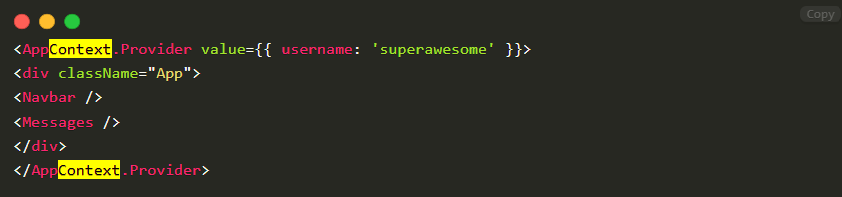
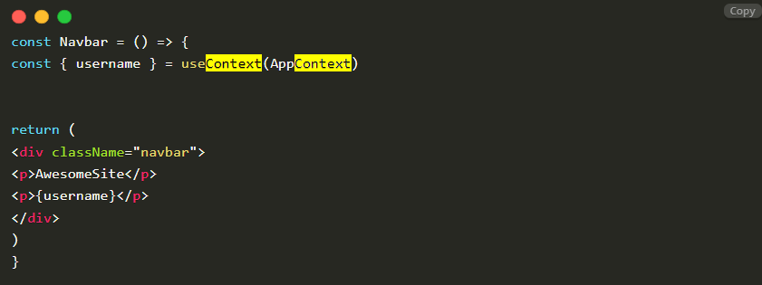
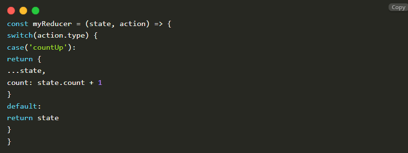
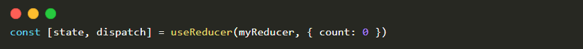
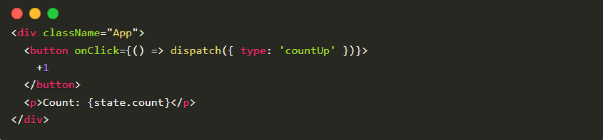

# Context và redux hỗ trợ hay thay thế nhau?

Hiện tại thì React Hooks đang dần trở nên phổ biến hơn nhờ vào cách nó quản lý state thông qua `useState` và `useEffect`. Cũng có nhiều bài viết giới thiệu về [**React Hooks**] và khuyên chúng ta nên sử dụng nó nhưng liệu thực sự thì Hooks có thể thay thế được **Redux** không – một kiến trúc đang rất ổn định và được đông đảo các lập trình viên tin dùng.

Để trả lời cho câu hỏi trên thì hôm nay chúng ta sẽ cùng nhau tìm hiểu xem sự khác nhau giữa **Redux** **và** **React Hooks** là gì!

Trước khi tìm hiểu xem **Hooks** có thể thay thế được Redux hay không thì chúng ta cùng xem luồng hoạt động chúng là như thế nào nhé!?

## **Redux**

### **Shared State**

Lý do đầu tiên mà các developer thường xuyên áp dụng **Redux** trong các dự án là vì khả năng chia sẻ state giữa các component. Để hiểu rõ hơn thì chúng ta cùng xem vấn đề sau đây: 

Trong component tree ở trên, ta có thể thấy **Navbar** component có khai báo 1 state là `username` và **Messages** component muốn sử dụng state đó. Với cách thông thường thì ta sẽ cần phải truyền state `username` lên **App** rồi từ **App** xuống **Body** và cuối cùng mới đến **Messages**. Xin chúc mừng, lúc này bạn đã rơi vào trap có tên gọi là **Prop drilling.**

**Prop drilling** đề cập đến việc truyền state thông qua các component trung gian, mặc dù những component này không quan tâm đến state đó thực sự rất cồng kềnh và khó chịu. Và **Redux** đã giải quyết được vấn đề trên bằng cách tập trung toàn bộ state trong app lại thành 1 **Store** duy nhất và tất cả các state trong **Store** này đều là global state, tức là nó có thể được sử dụng ở bất kỳ đâu trong component tree.

### **Consolidate Business Logic**

Kiến trúc trong **Redux** dựa trên **Flux** nhưng có nhiều ưu điểm được cải tiến hơn, với việc chia ra thành các thành phần nhỏ hơn, mỗi thành phần lại đảm nhận 1 nhiệm vụ riêng biệt cho nên **Redux** sẽ rất dễ maintain về sau:

- **Reducers**: Cho phép bạn xử lý các logic để cập nhật giá trị mới của state
- **Actions**: Là nơi nhận vào các dữ liệu bất đồng bộ và các logic phức tạp trước khi dispatch đến reducer
- **Middleware**: Về cơ bản nó nhận các action đầu vào rồi và trả ra cũng là các action trước khi dispatch đến reducer để xử lý
- **Redux-sagas**: Cho phép bạn thực hiện các request API và các tác vụ bất đồng bộ nhờ vào function generator

### **Enhanced Debugging**

Vì **Redux** nhận được sự support rất lớn từ cộng đồng nên cũng có khá nhiều tool ra đời nhằm phục vụ cho việc debug. Có thể kể ra 2 cái tên tiêu biểu là **Redux DevTools** và **Time-Travel Debugging**

#### **Redux DevTools**

Đây là 1 tool cực kỳ mạnh mẽ, được dùng để theo dõi flow của **redux** cũng như là sự thay đổi của state. Với việc quản lý state 1 cách trực quan hơn thì giờ đây bạn có thể theo dõi mọi thứ diễn ra trong app của mình, và nếu như trong app có xảy ra bug nào đó thì bạn có thể debug 1 cách dễ dàng khi đã biết nguyên nhân chính xác là gì.

#### **Time-Travel Debugging**

Hãy tưởng tượng bạn vừa thực hiện 1 hành động nào đó, sau đó bạn nhận ra rằng mình có thể tua lại hành động trước đó 1 cách dễ dàng như thể bạn có khả năng du hành thời gian vậy. Điều này thật tuyệt phải không nào, nó thực sự có thể giúp chúng ta trong việc debug những bug mà phải tốn nhiều thời gian để tái hiện lại nó.

## **REACT HOOKS**

Hooks được thêm vào React trong phiên bản 16.8, ngoài những hook cơ bản như là `useState`, `useEffect` thì Hook còn cung cấp cho chúng ta 3 hook có thể kết hợp với nhau để có chức năng giống như là **Redux**:

### **useContext**

Với những ai đã từng làm việc với **React.Context** thì chắc hẳn chúng ta đều biết rằng **Context** sẽ cho phép chúng ta truyền state đến component cao nhất trong component tree rồi từ đó ta có thể chia sẻ state đó đến những component khác trong cùng component tree.

Tuy nhiên nếu như phải sử dụng nhiều **context** thì đó sẽ thực sự là 1 vấn đề và với hook **useContext** chúng ta có thể giảm bớt vấn đề này đi 1 chút.

Đầu tiên chúng ta sẽ định nghĩa 1 **context**:

và bao bọc toàn bộ thành phần dom của component bằng thẻ **Provider**, đồng thời truyền giá trị mà mình muốn chia sẻ đến các component khác

Như vậy là chúng ta đã có thể sử dụng **context** đó trong các component con thông qua **useContext.**

### **useReducer**

Nghe cái tên thôi chúng ta cũng có thể đoán được ra nhiệm vụ của **useReducer** là gì rồi, đúng vậy, chức năng của **useReducer** khá giống với **Reducer** trong **Redux.**

Ví dụ, đầu tiên chúng ta sẽ định nghĩa 1 function tên là **myReducer**:

Sau đó, trong component chúng ta sẽ sử dụng **useReducer** với tham số là **myReducer** và 1 **initial state.**

Và cuối cùng, chúng ta có thể sử dụng state đó để hiển thị các giá trị khác, đồng thời chúng ta cũng có thể sử dụng `dispatch` để thay đổi giá trị của state:

Tóm lại là với **useContext** chúng ta có thể chia sẻ state tới các component, **useReducer** thì cho phép chúng ta cập nhật giá trị mới cho state giống như là Redux và với **useEffect** chúng ta có thể viết các action và dispatch chúng tới **reducer**… nghe khá là giống với flow của **Redux** phải không nào?

_**Tuy nhiên thì có 1 số điểm chúng ta cần phải lưu ý:**_

- Với **Redux** thì tất cả state được gom lại 1 đống gọi là **Store** và **Store** này là duy nhất, điều này thực sự là cần thiết khi app của bạn có quá nhiều state và bạn không thể nào quản lý được hết tất cả. Trong khi **useContext** thì chỉ có nhiệm vụ duy nhất là chia sẻ state, không có tính tập trung như **Redux** cho nên khi app mở rộng sẽ khó có thể kiểm soát được hết tất cả state trong app.
- Như đã nói ở trên thì với sự kết hợp của **useReducer** và **useEffect** ta có thể tạo ra được các **action** và **reducer** giống trong **Redux**, tuy nhiên đó chỉ là những action đơn giản, khi mà độ phức tạp của các action được tăng cao thì lúc này bạn sẽ rất khó để xử lý, trong khi đó thì với thư viện **Redux Sagas** hay **Redux middleware** thì chúng có cung cấp các hàm nâng cao để xử lý điều này.
- Và điều cuối cùng đó là về vấn đề debug, **Hooks** không có 1 tool nào hỗ trợ debug cả, chỉ có duy nhất 1 hook là **useDebugValue** có thể giúp chúng ta debug được 1 vài lỗi nhỏ mà thôi, về khoản này thì đúng là **Hooks** thua xa **Redux.**
