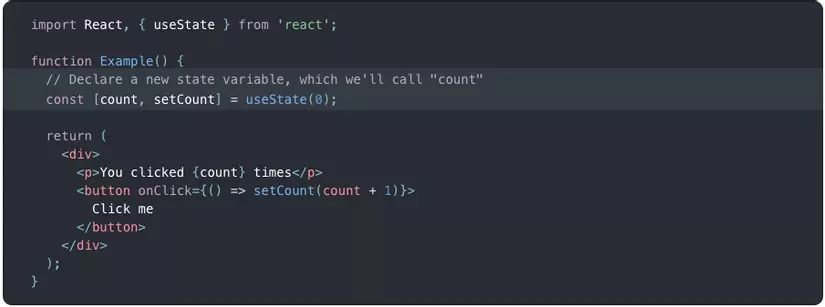
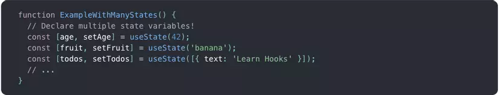
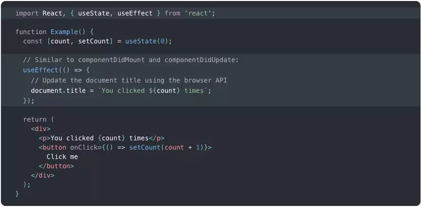
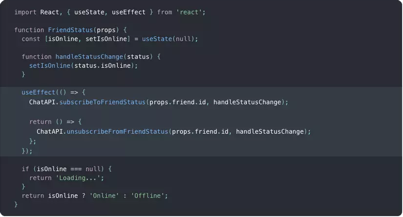
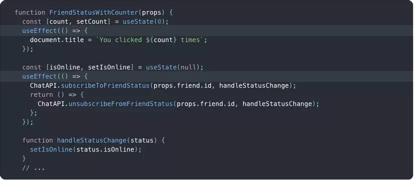

# Giới thiệu về React Hook

Bức ảnh phía trên là một ví dụ nhỏ về `React Hook`. Cụ thể hơn bạn có thể nhìn thấy hàm `useState` chính là một hàm thuộc về Hook. Vậy động lực nào mà Hook được hình thành, và Hook là gì ? Mời các bạn đến với phần đầu tiên.

## 1. Động lực

Hooks giải quyết được vô số vấn đề thuộc về React mà chúng ta đã gặp phải trong suốt năm năm viết và bảo trì code trong hàm triệu component. Khi bạn học React, dùng React, hoặc chọn những thư viện chứa các component, bạn sẽ nhận ra một số lỗi sau.

### 1.1 Rất khó để sử dụng stateful logic giữa các component

React không cung cấp một cách thức nào để chia sẻ những behavior có thể tái sử dụng giữa các component, bạn phải dùng những parttern như là `render props` hoặc `high-order component` . Nhưng những parttern này bắt buộc bạn phải tái cấu trúc lại các component để sử dụng, có thể dẫn đến khó hiểu và khó để theo dõi. Nếu bạn đã sử dụng tool như là `React DevTools` bạn sẽ thấy cái gọi là `wrapper hell` của các component bao gồm các provider, consumer, higher-order component, render prop, và những lớp trừu tượng khác. Mặc dù vẫn có thể filter được bằng `DevTools` nhưng nó đã thể hiện 1 vấn đề, chúng ta cần phải có một phương thức hiệu quả hơn để chia sẻ stateful logic.

Với Hook, bạn có thể trích suất stateful logic ra ngoài để test và để sử dụng ở nhiều nơi khác nhau mà không làm ảnh hưởng đến cấu trúc kế thừa của các component của bạn.

### 1.2 Các component sẽ trở nên càng phức tạp và càng khó hiểu

Thông thường chúng ta phải maintain các component mà bắt đầu từ đơn giản đến mức không thể quản lý được đống lộn xộn của stateful logic và hiệu ứng phụ. Mỗi method lifecycle thường bao gôm rất nhiều logic không liên quan đến nhau. Ví dụ component có thể thực hiện việc lấy dữ liệu ở trong `componentDidMount` và `componentDidUpdate`. Tuy nhiên, vẫn hàm `componentDidMount` có thể chứa vài logic không liên quan ví dụ như tạo listener, và xoá nó đi ở trong `componentWillUnmount`. Nhìn ra, những code liên quan đến nhau thì ở nơi khác nhau trong khi code không liên quan thì lại ở gần nhau. Điều này dễ dàng xảy ra bug và không liên kết với nhau.

Để giải quyết vấn đề này, Hook cho phép bạn chia một component ra thành các function nhỏ hơn để làm một công việc liên quan đến mình nó hơn là chỉ ném nó vào trong một hàm lifecycle.

### 1.3 Class làm cho cả con người và máy tính khó hiểu

Bạn sẽ phải hiểu `this` hoạt động như thế nào trong Javascript, cái mà rất khác biệt so với hầu hết ngôn ngữ khác. Bạn sẽ luôn phải nhớ bind các event handler. Con người có thể hiểu được prop, state, luông data nhưng vẫn gặp trở ngại với class.

Để giải quyết vấn đề này, Hook cho phép bạn sử dụng những chức năng của React mà không cần phải sử dụng đến class.

## 2. Hook là gì ?

### 2.1 State Hook

Ở đây, `useState` chính là một Hook. Chúng ta gọi nó trong một function component và thêm một số local state vào trong nó. React sẽ lưu trữ state này giữa các lần render. `useState` trả về một cặp : state lưu trữ giá trị hiện tại và một hàm để update giá trị đó. Bạn có thể gọi hàm này từ một event handler hoặc chỗ nào đó khác. Nó hoàn toàn giống với `this.setState` trong class ngoại trừ việc nó không merge state cũ và state mới lại với nhau.

Biến truyền vào `useState` là giá trị khởi tạo. Trong ví dụ nó là 0, giá trị khởi tạo này chỉ được sử dụng cho lần render đầu tiên.

Chúng ta có thể khai báo nhiều state trong cùng một function.

Vậy Hook là gì ?

**Hook là những hàm cho phép bạn truy cập vào React state và tính năng lifecycle trong function component. Hook không làm việc trong class, nó cho phép bạn sử dụng React mà không cần class.**

### 2.2 Effect Hook

Bạn có thể thực hiện việc lấy data, subcription, hoặc thay đổi những giá trị UI trong React component trước đây. Chúng ta gọi những công việc này là `side effect` (hiệu ứng phụ) bởi vì nó có thể ảnh hưởng đến các component khác và không thể thực hiện trong lúc render.

Effect Hook, `useEffect` cho phép thực hiện các hiệu ứng phụ trong các function component. Nó thực hiện công việc tương đương với componentDidMount, componentDidUpdate, và componentWillUnmount trong React class, nhưng gộp lại vào trong cùng một API.

You’ve likely performed data fetching, subscriptions, or manually changing the DOM from React components before. We call these operations “side effects” (or “effects” for short) because they can affect other components and can’t be done during rendering.

Khi bạn gọi `useEffect`, bạn đang bảo với React hãy chạy `effect` của bạn sau khi có sự thay đổi. Những hiệu ứng này có thể truy cập vào những prop và state. React chạy các effect này mỗi lần render. Effect có thể thêm việc quét dọn sau khi hết function.

Hook cho phép bạn sắp xếp những hiệu ứng phụ này với các thành phần liên quan đến chúng.

## Luật của Hook

Hook tồn tại duy nhất 2 luật mà bạn bắt buộc phải tuân thủ:

1.  Chỉ được gọi Hook ở trong tầng logic cao nhất. Không được gọi nó ở trong vòng lặp, điều kiện hoặc các nested function.
2.  Chỉ được gọi Hook ở trong `function component` hoặc `custom hook`. Không được gọi Hook trong các hàm Javascript thông thường khác.
