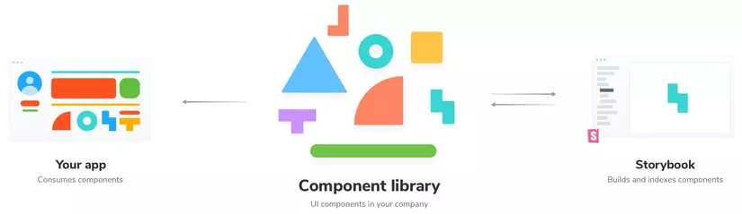
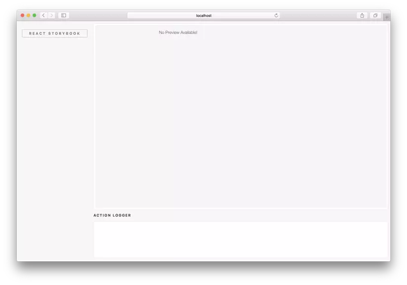

##Libs giải quết vấn đề gì?
Trong bài viết này, chúng ta sẽ xem xét một số thư viện thành phần React UI tốt nhất và cách chọn thư viện phù hợp với bạn. Bài viết này được viết chủ yếu cho các nhà phát triển React mới bắt đầu, nhưng bạn sẽ cần làm quen với các thuật ngữ cụ thể trong React.

React hỗ trợ giao diện người dùng (UI) của gần 10 triệu trang web trên khắp thế giới. Mặc dù thư viện cơ sở của React là vững chắc, nhưng có nhiều thư viện thành phần chứa đầy các yếu tố thiết kế có giá trị cho ứng dụng React hoặc dự án phát triển web của bạn.

Để giúp bạn tìm thấy thư viện React UI tốt nhất cho dự án hiện tại của mình, hãy cùng xem các thư viện React UI phổ biến nhất trên GitHub. Chúng tôi sẽ phân tích ứng dụng của họ trong quá trình phát triển và đưa ra các ví dụ, cũng như xem xét mức độ phổ biến của họ giữa các nhà phát triển dựa trên thống kê sử dụng từ GitHub và npm.
Hãy bắt đầu với lý do tại sao bạn nên nghĩ đến việc sử dụng thư viện React UI ngay từ đầu.

Tôi có cần Thư viện React UI không?

Mỗi thư viện thành phần React UI khác nhau đều có ưu và nhược điểm, chúng ta sẽ thảo luận chi tiết hơn bên dưới. Nhưng nói chung, sử dụng bất kỳ thư viện nào cũng có nhiều lợi ích sẽ giúp bạn khi làm việc trên dự án React của mình:

- Thân thiện với người mới bắt đầu . Thư viện giao diện người dùng bao gồm các thành phần được tạo sẵn như nút bấm, trường biểu mẫu, v.v. Vì vậy, là người mới bắt đầu, bạn sẽ không phải tìm cách tạo bất kỳ phần tử cần thiết nào từ đầu. Thay vào đó, bạn có thể tập trung vào việc triển khai và tùy chỉnh với sự trợ giúp của tài liệu.
- Tạo mẫu nhanh hơn. Với các thành phần React được tạo sẵn theo ý của bạn, bạn có thể nhanh chóng tạo một số nguyên mẫu hoạt động. Điều này có nghĩa là bạn có thể chứng minh rằng ý tưởng thiết kế đang hoạt động mà không cần phải dành quá nhiều thời gian cho bất kỳ chi tiết nào.
- Tiết kiệm thời gian. Sử dụng thư viện thành phần tiết kiệm thời gian không chỉ khi tạo mẫu mà còn khi đã làm việc trên dự án React của bạn. Nó cho phép bạn viết ít mã hơn, vì bạn sẽ không phải tự mình viết tất cả các câu lệnh.
- Các thành phần có thể nhận biết được bởi người dùng. Đổi mới ở một mức độ nhất định giúp dự án của bạn nổi bật. Nhưng quá nhiều đổi mới trong việc thiết kế UX / UI có thể khiến người dùng chùn bước. Vì các phần tử giao diện người dùng trong thư viện được thiết kế để trở nên phổ biến, chúng sẽ không gây ra bất kỳ khó khăn nào cho người dùng của bạn.
- Các thành phần có thể tùy chỉnh. Mặc dù phổ biến, hầu hết các Element đều có thể được tùy chỉnh được. Mỗi thư viện cung cấp cho bạn một lượng quyền kiểm soát tùy chỉnh khác nhau, nhưng bạn sẽ có thể đảm bảo rằng trang web của mình trông không giống với nhiều thư viện khác.
- Khả năng tương thích đã được chứng minh trên các thiết bị . Hầu hết các thành phần giao diện người dùng được xây dựng sẵn đều có khả năng đáp ứng di động (Responsive) theo mặc định, có nghĩa là bạn sẽ không phải mất công nghiên cứu nhiều để đảm bảo dự án React của mình hoạt động trên các loại thiết bị khác nhau.
- Có thể truy cập theo mặc định Hầu hết các thư viện thành phần React UI phổ biến đều có các tính năng trợ năng được tích hợp sẵn hoặc thậm chí tuân thủ đầy đủ WCAG hoặc các tiêu chuẩn và phương pháp hay nhất khác. Nhờ đó, bạn sẽ không phải lo lắng về việc tự mã hóa các thẻ ngữ nghĩa hoặc điều hướng bàn phím.
- Nguồn gốc từ cộng đồng. Thư viện thành phần giao diện người dùng thường có cộng đồng của họ tập trung xung quanh GitHub. Điều này có nghĩa là người dùng có thể nêu vấn đề, yêu cầu các tính năng và cũng có thể dễ dàng trở thành người đóng góp cho thư viện.

Mặc dù có nhiều ưu điểm như vậy, ngay cả những thư viện thành phần React UI tốt nhất cũng có một số nhược điểm mà bạn nên cân nhắc trước khi sử dụng:

- Tùy chỉnh các thành phần có thể khó khăn. Tùy thuộc vào thư viện cụ thể mà bạn chọn, mức độ dễ dàng tùy chỉnh các thành phần sẽ khác nhau. Với một số thư viện React, bạn có được các thành phần nguyên thủy được nhà phát triển tùy chỉnh rất nhiều, nhưng với những thư viện khác, việc đạt được kết quả bạn muốn có thể khá khó khăn.
- Thiết kế web tương tự với các trang khác . Mỗi thư viện React UI đều có hệ thống thiết kế của nó, vì vậy nếu bạn chọn sử dụng một thư viện phổ biến nhưng không tùy chỉnh đủ các thành phần hoặc chủ đề, trang web của bạn có thể trông rất giống với các trang web khác sử dụng cùng một thư viện – trong một số trường hợp, thậm chí không nguyên bản. Tuy nhiên, tùy thuộc vào dự án của bạn, đó có thể không phải là một vấn đề.
- Hỗ trợ dựa vào cộng đồng. Hầu hết các thư viện React UI không cung cấp hỗ trợ chính thức mà thay vào đó hướng dẫn người dùng của họ đến Stack Overflow, GitHub, Discord hoặc các kênh tương tự khác. Với các thư viện ít phổ biến hơn, cộng đồng nhỏ hơn và việc nhận trợ giúp có thể phức tạp hơn.

Vì vậy, với những cân nhắc quan trọng này, chúng ta hãy xem xét các thư viện phổ biến nhất dựa trên số liệu thống kê của GitHub. Chúng tôi đã liệt kê các thư viện dựa trên số lượng các dự án đang hoạt động của chúng trên GitHub, bắt đầu từ những dự án phổ biến nhất.

Đến cuối bài đăng này, hy vọng bạn sẽ tìm thấy thư viện thành phần giao diện người dùng dựa trên React tốt nhất cho dự án phát triển ứng dụng web hoặc ứng dụng dành cho thiết bị di động của mình.

**1. MUI (trước đây là Material-UI)**
![[​IMG]](./image2.webp)
Được sử dụng bởi hơn 745.000 dự án trên GitHub, MUI là một thư viện React đơn giản và có thể tùy chỉnh dựa trên phong cách thiết kế Material Design của Google. Vì vậy, MUI không chỉ đơn giản là một thư viện thành phần, mà là toàn bộ hệ thống thiết kế. Nó có một hệ thống bổ sung các hướng dẫn, nguyên tắc thiết kế và các phương pháp hay nhất về thiết kế giao diện người dùng. MUI được xây dựng trên 63,9% JavaScript và 36,1% TypeScript.

Bạn có thể sử dụng MUI với tập hợp lớn các thành phần của nó để dễ dàng tạo giao diện người dùng trong các ứng dụng React. Sử dụng các thành phần Material Design hiện có, tùy chỉnh chúng hoặc tạo hệ thống thiết kế của riêng bạn. Nhờ các thành phần làm sẵn và tài liệu chuyên sâu của MUI, bạn có thể tạo các ứng dụng web hoặc thiết bị di động sạch và đẹp một cách nhanh chóng – ngay cả khi có ít kinh nghiệm thiết kế trước đó.

Vì hệ thống thiết kế Material-UI mà MUI dựa trên được tạo ra bởi Google, nó cũng được sử dụng trên nền tảng của chính Google. Do đó, các thành phần MUI có thể có giao diện giống Google rõ ràng. Mặt khác, điều này có nghĩa là MUI có thể là một lựa chọn đặc biệt tuyệt vời để xây dựng ứng dụng Android, vì hình ảnh của ứng dụng sẽ phù hợp tốt với hệ điều hành.

Nhưng mặt khác, bất kỳ trang web hoặc ứng dụng nào được tạo bằng thư viện này – nếu không đủ tùy chỉnh – đều có thể dễ dàng liên kết với Google.

Tuy nhiên, nếu thấy có bao nhiêu MUI được sử dụng và có bao nhiêu ngôi sao GitHub, đây là một trong những thư viện thành phần React UI tốt nhất hiện có. Nó cung cấp một số lượng lớn các thành phần React, phù hợp với nhiều loại dự án phát triển có mục đích chung. MUI được sử dụng bởi medium, Scale AI và UNIQLO, trong số những người khác.

**2. Ant Design**
![[​IMG]](./image3.webp)

Được sử dụng bởi hơn 255.000 dự án trên GitHub, Ant Design tự mô tả chính nó như một hệ thống thiết kế và thư viện React UI dành cho người dùng cấp doanh nghiệp, có nghĩa là các phần tử được thiết kế để sử dụng cho doanh nghiệp. Nó được tạo ra bởi Alibaba, gã khổng lồ công nghệ Trung Quốc.

Ant Design cung cấp một tập hợp lớn các thành phần chất lượng cao, rất tốt để xây dựng toàn bộ khung giao diện người dùng một cách nhanh chóng – hoặc bạn có thể chỉ sử dụng các thành phần riêng lẻ. Thư viện được xây dựng trên 43,7% TypeScript, 31,1% JavaScript, 24,9% Ít hơn và 0,3% mã không xác định.

Ant Design là một thư viện thành phần React tuyệt vời, một phần nhờ vào tài liệu tuyệt vời của nó bao gồm nhiều hướng dẫn, ví dụ và các biến thể. Ngoài ra, nó cũng là một nền tảng mạnh mẽ khi có thể tùy chỉnh chi tiết các thành phần và chủ đề hiện có.

Hơn nữa, điều tuyệt vời về Ant Design là khả năng tương thích với rất nhiều thư viện React của bên thứ ba và một số sản phẩm của riêng họ, như AntV Data Visualization , Ant Design Charts và Ant Design Mobile . Những điều này giúp mở rộng số lượng các trường hợp sử dụng mà bạn có thể bao gồm các thư viện của họ.

Một trong những nhược điểm của Ant Design là kích thước gói rất lớn (1,2 MB), khi so sánh với các thư viện React khác, thường vào khoảng vài trăm kilobyte. Và nếu bạn không làm việc trên một dự án phát triển với nhu cầu kinh doanh đáng kể, thì thư viện này có thể hơi quá mức cần thiết.

Ngoài Alibaba, Ant Design cũng được sử dụng bởi Lenovo và Toyota, vì vậy nó là một lựa chọn tuyệt vời cho các dự án kinh doanh cấp cao. Và các nguồn thông tin kỹ lưỡng vẫn có thể làm cho nó trở thành một lựa chọn tuyệt vời cho người mới bắt đầu. Trên hết, nó thậm chí còn có nhiều sao trên GitHub hơn MUI, đó là bằng chứng cho thấy sự tuyệt vời của nó.

**3. Storybook**
**Storybook** là một công cụ thiết kế và phát triển những UI Components cho ứng dụng của bạn trên một môi trường hoàn toàn biệt lập. **Storybook** mang lại trải nghiện mới khi thiết kế những UI components tưởng chừng chỉ dừng lại ở khâu design trước khi chuyển sang giai đoạn code Frontend.



Ngày nay khi phát triển một dự án, chúng ta dành rất nhiểu thời gian để xây dựng những UI Components. Hơn hết, chúng ta cần chú trọng làm rành mạch các thuộc tính cũng như hiển thị hết các tính năng cần có (props and states) của những Components này...ngay từ **điểm khởi đầu**...Không thể phủ nhận đó là cái khó trong một dự án Frontend!

Dựa vào design ta có thể hoàn thiện một Component, hay thậm chí hoàn thành cả một Page. Nhưng bạn có chắc chắn chất lượng code vừa hoàn thiện đã cover toàn bộ các trường hợp? Những người đồng hành có tái sử dụng được hay bạn không viết lại một cái đã có 80% rồi?... Tất cả liệu đã tường minh?...

**Storybook** đã có ~28k star ở thời điểm này và nó được sử dụng rộng rãi bởi những ông lớn như Airbnb, Coursera, LonelyPlanet. Hãy bắt đầu khai thác lợi ích mà **Storybook** có thể mang lại.

### 2. Concept of Storybook

[**Storybook**](https://storybook.js.org/basics/quick-start-guide/) được phát triển dựa trên concept **UI Harness** của PhilCockfield (nay đã deprecated) mới đầu chỉ phát triển cho các ứng dụng **React**, sau đã mở rộng cho Vue và Angular. Các bạn có thể theo dõi Start guide Docs chính thức của package ở trên tương ứng từng framework.

Trong giới hạn của mình ở bài viết này (và có thể những bài sau) mình sẽ nói riêng về [**React Storybook**](https://storybook.js.org/basics/guide-react/).

Hãy lấy ví dụ trực quan, hãy tưởng tượng bạn đối mặt với một trong hai trường hợp sau trong dự án Frontend:

- **Trường hợp lý tưởng**: Design đã xong 98%, đã có StyleGuide, gần như các phần core là cố định sẽ không có thay đổi lớn nào.
- **Trường hợp éo le**: Design mới chỉ hoàn thành 60%, dự án lên kế hoạch làm những phần chính Frontend song song với design, vừa làm vừa cập nhật.

Trong cả hai trường hợp trên, mặc dù có được đưa vào **bất cứ hoàn cảnh nào**, chúng ta cũng sẽ chọn một cách làm 'chưa đúng', tôi sẽ nói rõ điều 'chưa đúng' này ở dưới đây:

Trường hợp éo le, bạn hoàn toàn có lý do để chia nhau ra code những page đã hoàn thành trước, làm được gì hay được đó, đơn giản vì chưa có StyleGuide cover toàn bộ dự án. Nhưng thực tế là dù có được đưa vào trường hợp lý tưởng, chúng ta cũng bỏ qua bước thiết kế từng Component mà thường bắt tay ngay vào từng page cụ thể, và chỉ xem StyleGuide như một tài liệu tham khảo, người trước làm chưa đủ thì người sau xem lại và bổ sung.

Cách này có nhiều rủi ro nhưng lại được áp dụng, lời lý giải có thể chấp nhận được:

- Các task hoàn thành page cụ thể mang lại 'cảm giác' value lớn hơn và dự án đang đi nhanh hơn.
- Thiết kế từng UI Component xong show ra như thế nào cho ổn? Rất khó có thể có một Template sẵn để áp dụng. Tạo riêng một route trong dự án để show UI Components?
- Ai làm phần này? Một người làm thì quá nặng, chia ra cả team làm thì quá rối.

**Storybook** sẽ là một lời giải cho bài toán này...

- Chúng ta sẽ gọi các UI Components vừa thực hiện ra và gán cho nó một 'câu chuyện' - Đó chính là hiển thị toàn bộ các props và state. Bất cứ ai khi viết xong Components của mình đều có thể tạo ra câu chuyện của mình được, hoàn toàn không conflict.
- Những câu chuyện này hiển thị đầy đủ và **độc lập** - **Storybook** chạy ở một port riêng, có thể chạy song song với dự án. Việc này giúp ích chúng ta rất nhiều khi chỉnh sửa và theo dõi trạng thái của các elements, rất trực quan và nhanh chóng.

Khi run **Storybook** sẽ chạy một web server riêng ở port 6006 và có giao diện như dưới đây:

```none
npm run storybook

```



Một Component được đưa vào kịch bản rất đơn giản dưới đây:

```js
import React from "react";
import YourComponent from "../YourComponent";
import { storiesOf } from "@storybook/react";
import { action } from "@storybook/addon-actions";

storiesOf("YourComponent", module)
  .add("state 1: active", () => (
    <YourComponent onClick={action("clicked")}>
      This component is activated
    </YourComponent>
  ))
  .add("state 2: disabled", () => (
    <YourComponent disabled>This component has been disabled</YourComponent>
  ));
```

Một ví dụ cụ thể bạn viết stories cho **MainSection** của TodoMVC huyền thoại:

```js
import React from "react";
import MainSection from "../MainSection";
import { storiesOf } from "@storybook/react";
import { action } from "@storybook/addon-actions";

storiesOf("MainSection", module)
  .add("all active", () => {
    const todoItems = [
      { id: "one", text: "Item One", completed: false },
      { id: "two", text: "Item Two", completed: false },
    ];

    return getMainSection(todoItems);
  })
  .add("some completed", () => {
    const todoItems = [
      { id: "one", text: "Item One", completed: false },
      { id: "two", text: "Item Two", completed: true },
    ];

    return getMainSection(todoItems);
  })
  .add("all completed", () => {
    const todoItems = [
      { id: "one", text: "Item One", completed: true },
      { id: "two", text: "Item Two", completed: true },
    ];

    return getMainSection(todoItems);
  });

function getMainSection(todos) {
  const actions = {
    clearCompleted: action("clearCompleted"),
    completeAll: action("completeAll"),
  };

  return (
    <div className="todoapp">
      <MainSection todos={todos} actions={actions} />
    </div>
  );
}
```

**Concept của Storybook luôn luôn đòi hỏi** chúng ta phải hoàn thành, bổ sung Styleguide trước tất cả các công việc còn lại. Đây là cách tốt nhất để phát triển và document ứng dụng. Hãy xem những Styleguide ví dụ điển hình từ [Coursera](https://building.coursera.org/coursera-ui/) hay [GumGum](http://gumdrops.gumgum.com/index.html)

### 3. Storybook is powerful

**Storybook** sẽ là một trợ lực đáng giá từ những ngày dự án còn trong trứng nước với những features được khẳng định:

- Được build với những lib/framework lớn đương đại: Angular, React, Vue.
- Môi trường phát triển cho từng Component riêng biệt, tách rời, base trên rất nhiều iframe. Giao diện đơn giản, thống nhất, dễ tiếp cận.
- Suport **HMR**, bất kể Component của bạn là gì.
- Chạy bên trong dự án của bạn và có thể sử dụng server static.
- Extendable với đa dạng plugin (phong phú và chi tiết cho stories của bạn, cũng như có thể đặt hoàn cảnh test...)

Mình rất hi vọng đây sẽ là một giải pháp mới khi tiếp cận những dự án Frontend SPA!
