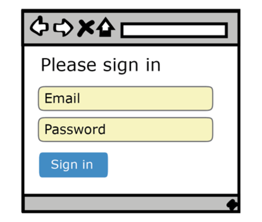
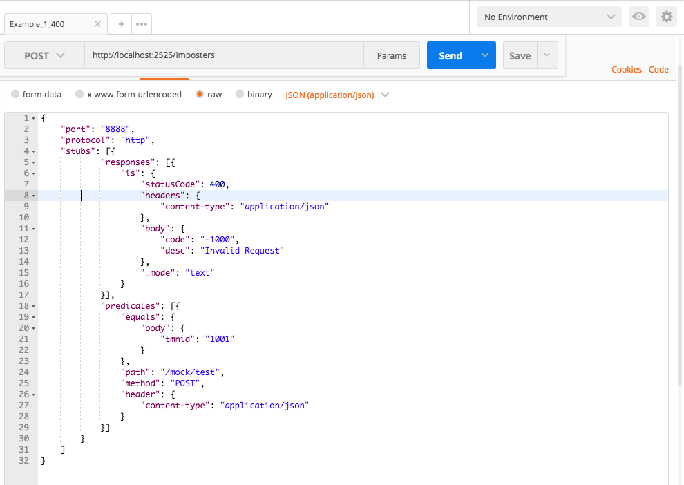
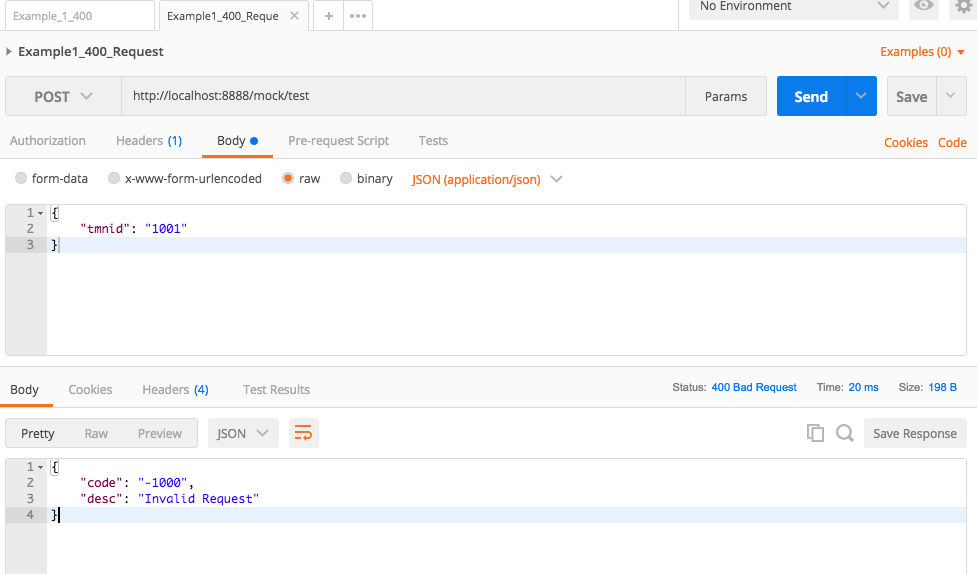

##Mock data như thế nào?
Khi đi sâu vào thiết kế Automation UI test case cho các công ty mà tôi làm việc, điều khiến tôi cảm thấy không hài lòng nhất về test case của mình là **nó chậm và bị duplicate.** Chậm là khó tránh khỏi cho 1 UI test case. Về vấn đề duplicate, đó là bởi vì tôi thấy rằng mình đã test những API liên quan đến UI test này rồi. Nếu bây giờ tôi viết lại 1 test case UI, thì vô hình chung tôi đã làm lại công việc test cho những API mà tôi đã viết test, vì API phải work thì cái UI test của tôi mới work.

Để giải quyết vấn đề đó, tôi được giới thiệu về khái niệm mock test, theo tôi mock test là một trong những cách để tách biệt UI test ra khỏi sự phụ thuộc vào tình trạng của Back End server từ đó giúp test case chạy nhanh hơn và kiểm chứng độ đúng đắn của UI một cách độc lập hơn.

## 1/ Mock test là gì?

Có rất nhiều thứ tương tự Mock test, cả tôi cũng không tìm hiểu hết về chúng. Nó bao gồm: Server Virtualization, Stubbing, Mocking,... Nó nằm trong một khái nhiệm chung gọi là Test Double. Nếu như tôi giải thích theo ý kiến riêng của mình thì:

> Mock test là khái niệm dùng để chỉ rằng, thay vì lấy data từ 1 real service, bạn sử dụng một bộ test data mà input và output của bạn được định nghĩa rõ ràng từ một server giả khác (mock) và bạn dùng nó như là input cho cái system mà bạn muốn test.

## 2/ Cách tiếp cận cổ điển của UI Automation test

Lại ví dụ về cái form login:

Khi bạn điền thông tin Email password và click Sign in, bản chất là System này gửi 1 HTTP request: http://realapiserver/login với data {"email":"testemail@test.com","password":"123"}. Hãy cứ giả sử test case của bạn là hy vọng màn hình trả về HomePage

Cách tiếp cận cổ điển này có nhiều bất cập:

1/ Bạn mang tiếng là test Front End, nhưng thực ra là bạn phải đợi cho Back End trả về. Đôi khi nó khá mất thời gian trong tổng số step của bạn

2/ Nếu Back End sai, tức là thay vì mình nhập data đúng nó phải trả về Success thì nó lại trả về fail --> test case UI cũng fail. Thực ra thì, nếu đây xem như là e2e test case thì OK. Nhưng mà, ý tôi là người làm Front End không có cơ hội để kiểm tra cái code mình làm ra có đúng hay không, vì Back End đã bị sai rồi. Nếu team bạn có apply CI/CD thì nó sẽ là thiệt thòi lớn cho bạn.

3/ Nếu cái API này chưa có, là coi như bạn khỏi kiểm tra Front End luôn. Như vậy, Back End API cứ phải chạy trước Front End. Front End có muốn làm trước cũng không được.

Nói tóm lại, nếu bạn chỉ muốn test UI, vì cái mà team bạn làm ra, hoặc là cái mà công ty bạn làm cho khách hàng chỉ là UI. Hoặc team của bạn muốn làm UI trước Back End mà **vẫn muốn tìm ra những lỗi chỉ do code của bạn gây ra**, thì mock test là một trong những lựa chọn hợp lý.

Mock test cũng gần như là bắt buộc khi bạn phải giả lập một server của 1 3rd party ( ví dụ app payment của bạn liên kết với server ngân hàng). Trong trường hợp này, bạn buộc phải tạo ra 1 mock server, và cấu hình input và output của nó theo như document được thỏa thuận giữa bạn và 3rd party.

## 3/ Cách để viết một mock test case

Điểm khác biệt lớn nhất giữa việc viết 1 mock test và 1 test case bình thường đó là bạn không cần phải tạo test data, và bạn cũng biết rõ được kết quả kỳ vọng là gì.

Khi viết test case, bạn cần chắc chắn rằng, cái bạn input trên Front End sẽ trùng với cái bạn định nghĩa ra ở mock server. Nếu không, bạn sẽ không thể có kết quả như mong muốn

## 4/ Cách thiết lập 1 mock server

Để có một test server và tích hợp vào code của Dev, đây là những step cơ bản:

- Setup 1 mock server. **Mountebank** là 1 option, nhưng cũng có nhiều mock server khác. [Setup mountebank](https://www.npmjs.com/package/mountebank)
- Start con mock server lên.
- Bước kế tiếp là quan trọng, bạn định nghĩa ra với request có những điều kiện gì, thì response sẽ là như thế nào. 1 ví dụ của Mountebank. Để tạo ra 1 mock của Mountebank bạn có thể dùng API:

Ở đây tức là mình vừa tạo ra 1 mock có logic là:

nếu tôi call vào API localhost:2525/mock/test, Method: POST, Header có dạng "application/json". và có body request là {"tmnid": "1001"} thì response trả về sẽ là phần định nghĩa trong "response":

- Developer của bạn **khi deploy UI để test, thì thay vì để UI trỏ vào Back End server, họ sẽ trỏ vào con mock của bạn**. Nghe thì có vẻ khó nhưng thực ra thì tôi thấy phần lớn trường hợp Developer đã để sẵn 1 config parameter cho vấn đế này, vì chính bản thân họ cũng phải deploy code của họ lên nhiều môi trường (Staging, Alpha, Production,...), cho nên họ chỉ cần sửa đúng cái config này là ổn.
- Cuối cùng run test case của bạn.

## Lời kết

Mock test là một trong những cách để chúng ta có thể test được những trường hợp liên quan đến 3rd party server. Nếu sử dụng đúng đắn, nó có thể giúp bạn tiết kiệm được rất nhiều thời gian khi viết test và chạy test mà vẫn đảm bảo được chất lượng của feature. Chúc các bạn thành công trong việc áp dụng mock test vào hệ thống test case của bạn.
