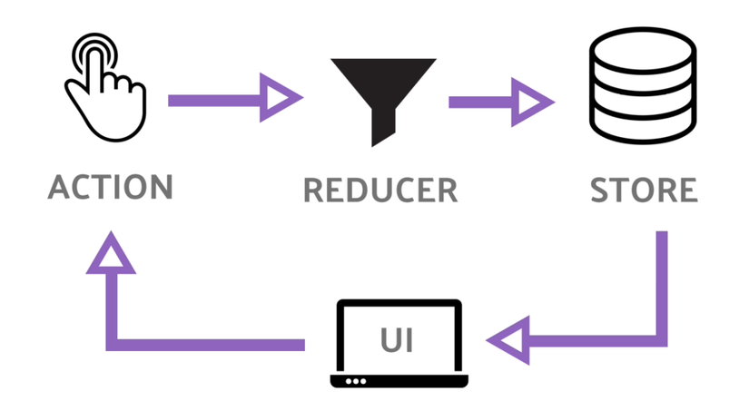
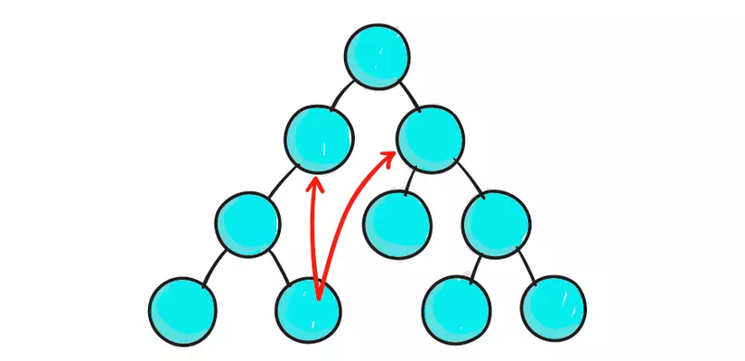
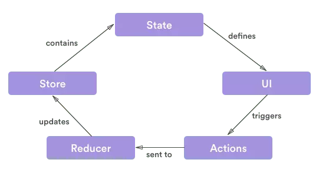

# Khi nào nên (và không nên) sử dụng Redux



Công việc quản lý state với những hệ thống lớn và phức tạp là một điều khá khó khăn cho đến khi Redux xuất hiện. Lấy cảm hứng từ design pattern Flux, Redux được thiết kế để quản lý state trong các project JavaScript. Mặc dù nó được sử dụng chủ yếu với React, nhưng chúng ta có thể sử dụng Redux với các framework khác như jQuery, Angular hoặc Vue.

Với kích thước rất nhỏ, (chỉ 2KB bao gồm các dependency), Redux đảm bảo rằng mỗi `component` đều có quyền truy cập trực tiếp vào state của project mà không cần phải truyền `props` xuống các `component` con hoặc sử dụng các hàm callback để truyền data lên các `component` cha.

Ở bài viết này mình sẽ nói về bản chất của Redux và giúp bạn quyết định xem project của bạn có thật sự cần sử dụng Redux không ?

# Tại sao cần dùng Redux ?

Thông thường, chúng ta không nên sử dụng tất cả những cái mới tinh và áp dụng vào app của chúng ta trong khi chưa hiểu được xem nó làm được gì. Rốt cuộc thì không phải các component đều có state riêng của chúng sao? Vậy tại sao chúng ta lại cần một công cụ để quản lý các state đó nhỉ?

React dù đứng một mình thì nó vẫn đỉnh. Chúng ta có hoàn toàn có thể build một project hoàn chỉnh với chỉ React. Nhưng khi project của bạn ngày càng lớn, với ngày càng nhiều component, việc chỉ sử dụng duy nhất React để quản lý state sẽ trở nên rất phức tạp.

Đây chính là lúc Redux toả sáng; nó làm giảm bớt sự phức tạp trong các ứng dụng lớn như vậy. Nếu bạn đã hiểu qua về React thị bạn sẽ biết rằng luồng dữ liệu của React bắt đầu từ các component cha truyền các props cho các component con. Trong một ứng dụng khổng lồ với cả tấn dữ liệu phải chạy qua rất nhiều component thông qua state và props, thì tin mình đi, code của bạn sẽ trở nên cực kì khó đọc và khó cải thiện, chưa kể là tiềm ẩn nhiều bug ko đáng có.



Trong React (và các framework khác nữa), việc giao tiếp giữa 2 component không có quan hệ cha-con thường không được khuyến khích sử dụng. React có lời khuyên rằng nếu bắt buộc phải làm việc này, chúng ta có thể build một hệ thống tuân theo pattern Flux - đây chính là lúc Redux thể hiện.

Với Redux, chúng ta có một `store` nơi chứa tất cả các state. Nếu một state thay đổi ở component A, nó sẽ được phản ánh lên store, và những component cần biết đến sự thay đổi state này ở component A có thể subcribe lên store.


Component A gửi thay đổi state lên store, nếu component B và C cần state này thì chúng có thể lấy trực tiếp từ store.

Dễ hiểu hơn chưa nhỉ ? Nếu chúng ta để các component tự giao tiếp với nhau thì nó sẽ tạo ra một mớ code hỗn độn và tiềm ẩn nhiều lỗi không đáng có. Redux làm cho mọi thứ dễ dàng hơn nhiều.

Bên cạnh nhiệm vụ chính, có nhiều lợi ích khác khi sử dụng Redux. Đây là 3 lợi ích mà mình cảm thấy là quan trọng nhất:

**1, Output đồng nhất, dễ đoán.**

Với chỉ một "Source of Truth" (store), chúng ta sẽ gặp ít vấn đề trong việc sync state giữa các component với nhau hơn.

**2, Khả năng maintain**

Redux có bộ guideline hết sức chặt chẽ về cách tổ chức code, action làm gì, reducer làm việc gì,... Mọi thứ đều cụ thể và rõ ràng nên việc maintain sẽ dễ dàng hơn nhiều.

**3, Khả năng scale**

Như đã nói ở trên, với việc tổ chức code nghiêm ngặt và rõ ràng, việc scale project sẽ trở nên dễ dàng hơn nhiều.

# Có thể bạn lại không cần đến Redux

Thực tế chúng ta không nhất thiết phải sử dụng đến Redux. Trong một số trường hợp chúng ta còn không nên sử dụng nó. Nếu một hoặc vài điều sau đây đúng với bạn thì có thể bạn không cần dùng đến Redux đâu:

- Nếu bạn và đồng nghiệp đã thống nhất với một hệ thống hay phương thức chung để chia sẻ và quản lý state giữa các component.
- Nếu App của bạn chỉ chứa nhưng action cơ bản như thay đổi UI, những thay đổi không cần thiết dùng đến store của Redux và có thể handle ở mức Component.
- Bạn không cần quản lý các thay đổi từ Server (server side events - SSE) hay websockets
- Mỗi một màn hình/view lấy data từ một nguồn khác nhau.

# Các thành phần của Redux

Redux bao gồm 3 thành phần chính: action, store và reducer:



## Action

Action đơn giản là những Event được tạo ra bằng việc sử funcion và gửi data từ app lên store. Data có thể được gửi bằng nhiều cách như submit form, gọi API hoặc thao tác của User. Mỗi action của Redux để có một thuộc tính `type` để miêu tả loại action và thuộc tính `payload` chưa thông tinh được gửi lên store. Một ví dụ đơn giản về action:

```javascript
// action
{
    type: SIGN_IN,
    payload: {
        username: 'example',
        password: 'Aa@123456'
    }
}

// function tạo ra action trên
function signIn(data) {
    return {
        type: SIGN_IN,
        payload: data
    }
}


```

Để gọi một action từ bất cứ đầu trong app, Redux sử dụng method `dispatch()` để gửi action tới Redux store để xử lý thay đổi state:

```javascript
dispatch(userLogin(data));
```

## Reducer

Vì Redux sử dụng `dispatch()` để thay đổi state. Tuy nhiên method này chỉ dùng để thông báo có sự thay đổi, thực tế nó không thay đổi state, các reducer mới là thứ nắm vai trò này.

Reducer là những function lấy state hiện tại và action vừa được dispatch để trả về state mới.

```javascript
const handleLogin(state, action) => {
    state.auth = action.payload;
    return state;
};

```

Khi build những ứng dụng lớn, chúng ta nên sử dụng method `combineReducers()` của Redux để kết hợp tất cả các reducer lại thành một list các reducer, mỗi một reducer xử lý state của một feature cụ thể.

```javascript
const rootReducer = combineReducers({
  signUp: signUp,
  signIn: signIn,
  editProfile: editProfile,
});
```

Các reducer neên được việc dưới dạng pure function. Một số đặc điểm của chúng:

- Không gọi tới API hoặc DB
- Các giá trị trả về chỉ được phụ thuộc vào gía trị của tham số truyền vào.
- Các tham số phải immutable

## Store

Store chính là trái tim của Redux. Đây là "single source of truth" nắm giữ toàn bộ state của app và cung cấp những method để thao tác với state, dispatch action, ... Mỗi action được dispatch sẽ trả về state mới cho store bằng reducer.

Một ví dụ về store:

```javascript
import { createStore } from‘ redux’;

let store = createStore(indexReducer);
let signInInfo = {
    username: 'example',
    password: 'Aa@123456'
};

store.dispatch(signIn(signInInfo));

```

## Kết

Đúng là Redux là một thư viện tuyệt vời để quản lý state của ứng dụng, cũng đúng là Redux đã đạt được rất nhiều sức hút với các hệ thống lớn. Bên cạnh việc được sử dụng rộng rãi bởi các công ty như Uber và Twitter, Redux cũng đã được triển khai thành công trên các dự án như WordPress. Chắc chắn rằng Redux là sự cải thiện tuyệt vời cho mọi ứng dụng Javascript hiện có.

Các ứng dụng chủ yếu thực hiện các thao tác đơn giản và không yêu cầu Server-side Rendering có thể không cần đến Redux; các action của chúng có thể được xử lý ở component level.

Dù sao thì Redux cũng là một công cụ tuyệt vời và mình nghĩ bạn nên tìm hiểu, đặc biệt nếu bạn làm việc với React.

Cảm ơn các bạn đã đọc.
